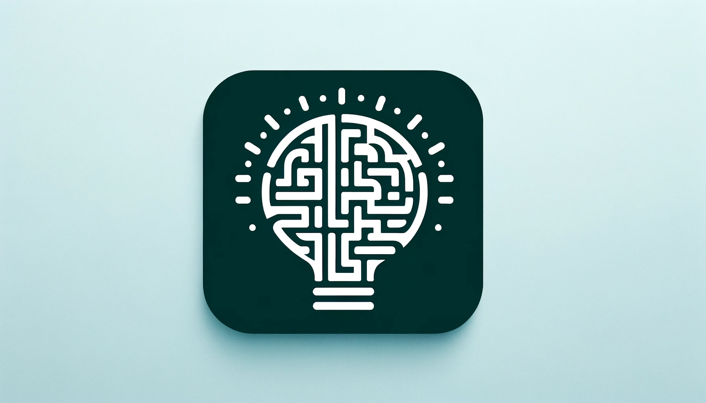

# Maze Solver: Intelligent Agents Assignment 1

[](https://github.com/H-tr/Agent-Decision-Making/actions/workflows/python-test.yml)



## Overview

This project is the first assignment for the SC4003-CE4046-CZ4046-INTELLIGENT AGENTS course. It involves implementing value iteration and policy iteration algorithms to solve a maze environment. The goal is to find the optimal policy and utilities for all non-wall states in the maze.

## Getting Started

### Installation

1. Clone the repository:

   ```bash
   git clone https://github.com/H-tr/Agent-Decision-Making.git
   ```

2. Navigate to the project directory:

   ```bash
   cd Agent-Decision-Making
   ```

## Usage

1. Create the python environment

```bash
conda create -n maze_solver python=3.10 -y
conda activate maze_solver
pip install -r requirements.txt
```

1. Run the main logic

To monitor the iteration progress

```bash
tensorboard --logdir=runs
```

```bash
python main.py
```

1. Test

```bash
python -m unittest tests.test_maze_solver
```

## Project Structure

## Contributing

Contributions are welcome! Please feel free to submit pull requests or open issues to improve the project.

## License

This project is licensed under the MIT License - see the [LICENSE](LICENSE) file for details.

## Acknowledgments

- Course instructors and teaching assistants for providing guidance and support.
